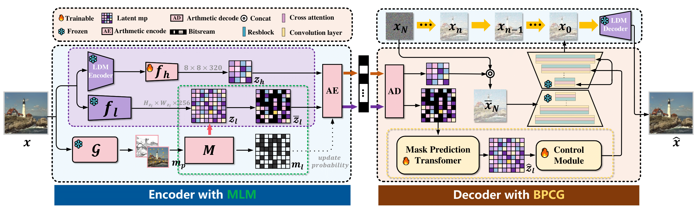
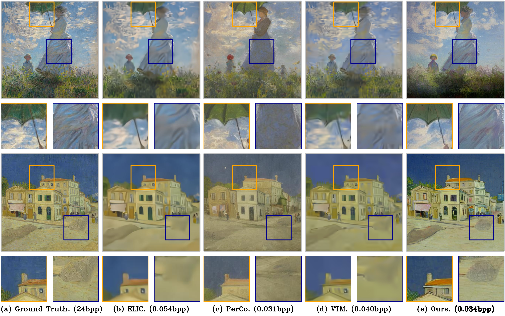
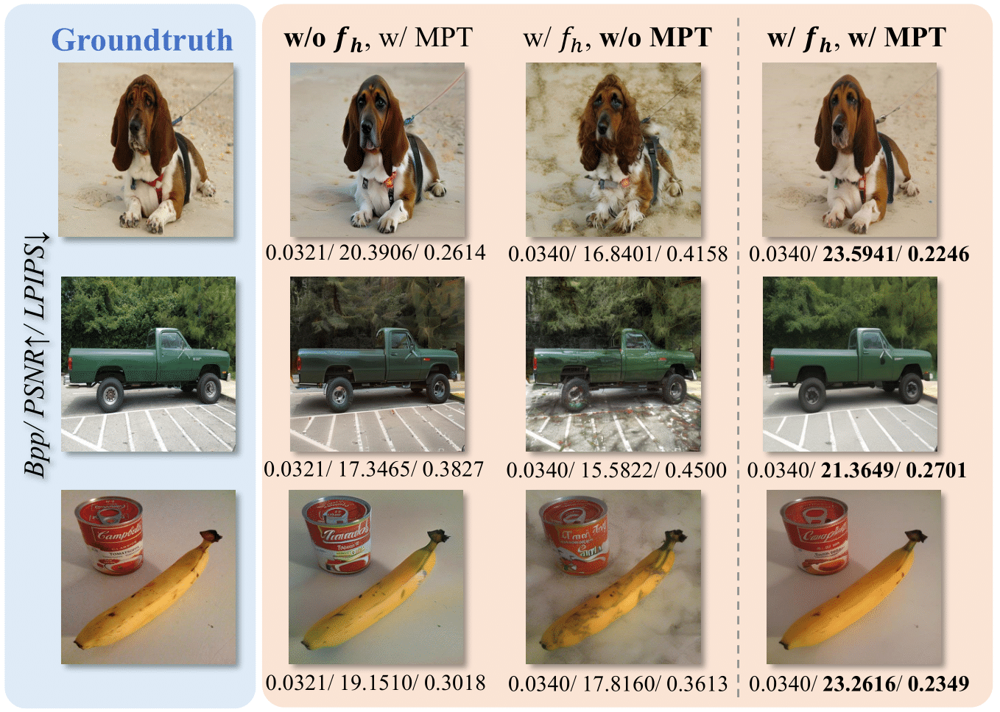
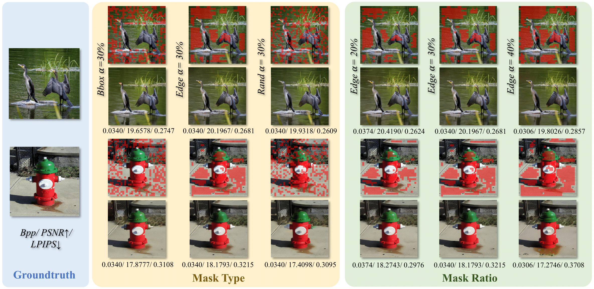

# Decouple Distortion from Perception: Region Adaptive Diffusion for Extreme-low Bitrate Perception Image Compression

#### <a name="intro">:rocket: This repository is the official implementation of MRIDC.

## :sunny: Overview

     

 

## :memo: TODO
- [ ] Release inference code
- [ ] Release training code
- [ ] Release pretrained models

## :eyes: Visualization results

     

The org pictures in Figures E and F of the supplementary material are incorrect; we have included the corrected versions here.

Figure E.

     

Figure F.

     

## :eyes: Ablation Study results

     

     

## :crossed_swords: Quantitative Performance

     

